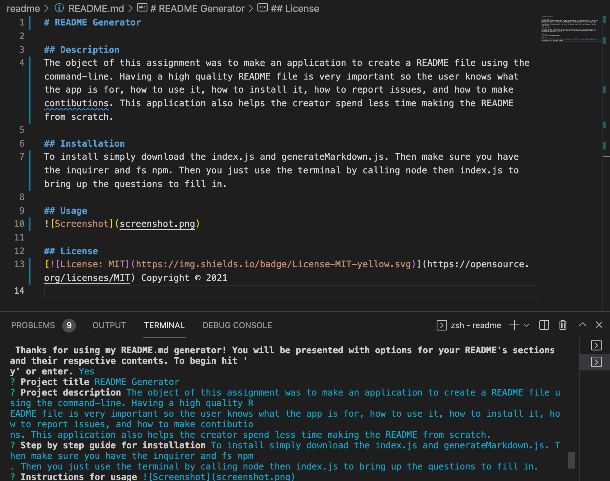

# README Generator

## Description
The object of this assignment was to make an application to create a README file using the command-line. Having a high quality README file is very important so the user knows what the app is for, how to use it, how to install it, how to report issues, and how to make contributions. This application also helps the creator spend less time making the README from scratch.

## Installation
To install simply download the index.js and generateMarkdown.js. Then make sure you have the inquirer and fs npm. Then you just use the terminal by calling node then index.js to bring up the questions to fill in.

## Usage

## License 
 Copyright © 2021
